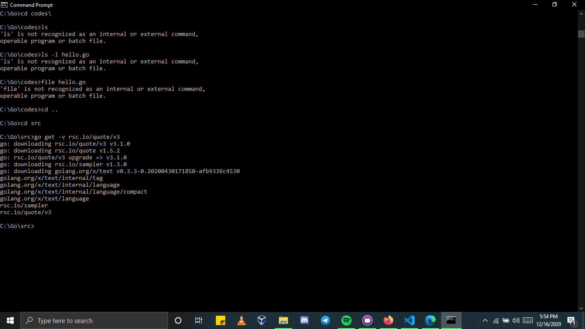

<p>
  <h2 align="center"> DAY 2</h2>

# Two Go rules :
  * ### You either use a Go package or you do not include it

        
          - Go has strict rules about package usage.
          - Therefore, you cannot just include any package you might think that you will need and then not use it afterward.
          - So, using an underscore character in front of a package name in the import list will not create an error message in the compilation process
        

  * ### There is only one way to format curly braces
    ```GO
    package main
    import (
           "fmt"
    )
    func main()
    {
          fmt.Println("Go has strict rules for curly braces!")
    }
    ```
      * <p>Putting the opening curly brace ({) in its own line will make the Go compiler insert a semicolon at the end of the previous line (func main()), which is the cause of the error message.
      </p> 
  <br>
  <br>
 
  # Downloading External packages for Go 
  
   <br />

  <h3>$go get -v rsc.io/quote/v3</h3>  // Download the external package from web 
 
    * Visit pkg.go.dev and search for a ["quote"](https://pkg.go.dev/search?q=quote) package.
    * Locate and click the rsc.io/quote package in search results (if you see rsc.io/quote/v3, ignore it for  now).
    * On the Doc tab, under Index, note the list of functions you can call from your code. You'll use the Go function.
    * At the top of this page, note that package quote is included in the rsc.io/quote module.
  
  ### You can delete the intermediate files of a downloaded Go package
  <h3>$ go clean -i -v -x rsc.io/quote/v3</h3>
  <h3>$ rm -rf ~/go/src/rsc.io/quote/v3</h3>
  </p>


